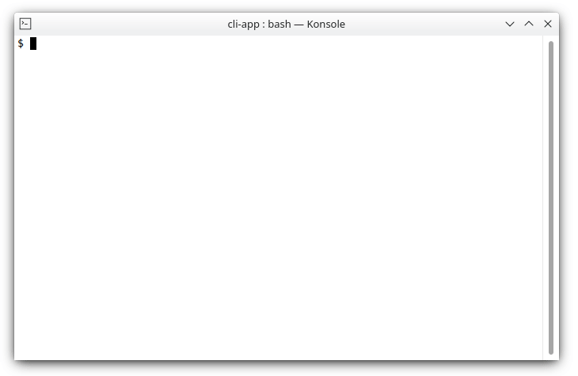

# afeefa/cli-app

Create a `symfony/console` PHP cli app with a minimum of configuration.

## Description

At times a project could need an accompanying cli tool to perform some configuration, installation or maintenance tasks. It shouldn't be much effort to get one running, especially, if it's about just a few commands. This package is a convenience wrapper around the PHP's [symfony/console](https://github.com/symfony/console) framework and aims to simplify the creation of cli apps. It provides:

* all, what `symfony/console` provides
* fluent interface to create (nested) commands
* selectable sub commands
* reusable actions
* helper functions for input, output and process execution

## Basic Example

The most basic example shows the workflow of `cli-app`. You create one or more commands (usually in a separate file) and add those commands to the application instance by providing a command name and a description.

File: `pets.php`

```php
<?php

require_once __DIR__ . '/../../vendor/autoload.php';

use Afeefa\Component\Cli\Application;
use Afeefa\Component\Cli\Command;

class Cats extends Command
{
    protected function executeCommand()
    {
        $this->printList(['Molly', 'Felix', 'Minka']);
    }
}

class Dogs extends Command
{
    protected function executeCommand()
    {
        $this->printList(['Bella', 'Charlie', 'Luna']);
    }
}

(new Application('Pets App'))
    ->command('cats', Cats::class, 'Show cats')
    ->command('dogs', Dogs::class, 'Show dogs')
    ->run();
```

You can run this app from the command line:

```shell
$ php pets.php
```



To [run the app as a normal shell command]() (without typing `php`) you need a little boilerplate. See the documention.

## Install

Install via composer as usual:

```bash
composer require afeefa/cli-app
```

## Run the example

```bash
git clone git@github.com:afeefacode/cli-app.git
cd cli-app
composer install
example/cli
```
